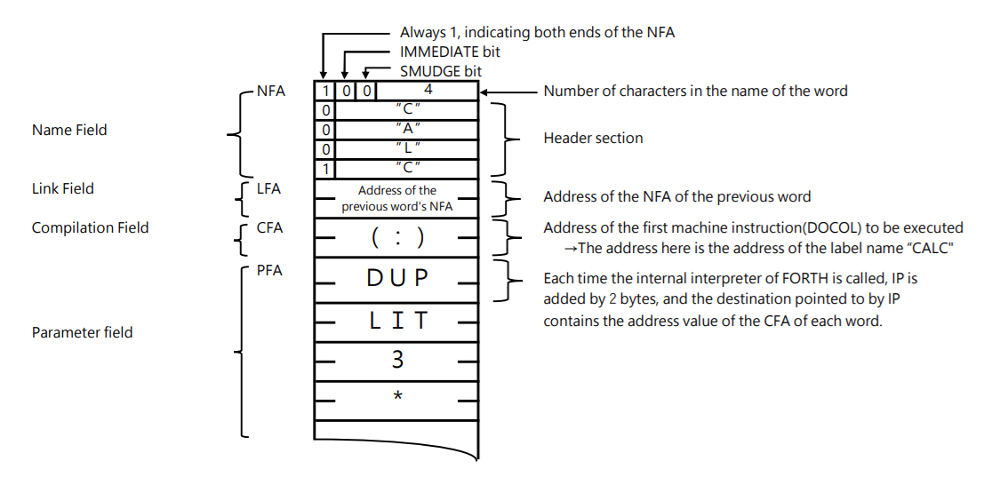

# A brief note on the structure of FIG-FORTH v64  
The explanation from here on is given in the FIG-FORTH source code, as the ToUnderstandFORTH explanation is not yet organized.  
   
FIG-FORTH is made up of a “dictionary” of words and a “FORTH_INNER_INTERPRETER” written in machine language.  
  
## (1) Dictionary structure 
The “dictionary” is a collection of all the registered words. Each word contains all the information necessary for that word. In FIG-FORTH, each word is divided into four parts: NF, LF, CF, and PF. For details, please refer to the diagram, but in general, it is divided as follows.  
  
**NF (Name Field)**  
 This contains the word name, the number of characters in the word, and the IMMEDIATE/SMUDGE bit.  
**LF (Link Field)**  
 This contains the NFA of the word registered immediately before.  
**CF (Compilation Field)**  
 This contains the address of the machine code (machine code starting from DOCOL, the top address of the machine code stored in the word “:”) that will be executed first when this word is executed.  
**PF (Parameter Field)**  
 As mentioned in the CF, when this word is executed, the processing in the CF is carried out first. After that, the PF is executed. In the PF, the word information is entered in order. To be more precise, each CFA is entered in order according to the order of each word.  
   
If the machine code starts from the beginning of the PF, the starting address of the machine code to be executed is entered at the beginning of the PF, and the sequence of machine code is entered after that. In some cases, the first part is a series of word addresses, and the middle part is machine code, but we will not go into that here.  
  
NFA is an abbreviation for (Name Field Address), and CFA is an abbreviation for (Compilation Field Address).  
The data length stored in LF, CF, and PF is 2 bytes (8 bytes in ToUnderstandFORTH) because FIG-FORTH handles 16-bit data.  
  
  
  
The following is an example (only a part) of a word “CALC”.  
  
  
 
  
  
## (2) Structure of the internal interpreter  
FORTH_INNER_INTERPRETER is the internal interpreter of FORTH (or, to use the current terminology, a VM (-->Virtual Machine)). It determines the word (execution address) to be executed next, and transfers (jumps to) processing to that word. When processing of that word is complete, it starts up again and transfers processing to the next word.  
Basically, it is the following machine code. As a beginner in FORTH, when I saw this code, I was truly amazed, thinking, “The FORTH internal interpreter is made up of just these simple instructions!  
  
```  
****FORTH_INNER_INTERPRETER****  
  
DPUSH: PUSH RDX              ; [^Note 2]  
APUSH: PUSH RAX  
NEXT:  LODSQ                 ; RAX <- (RSI)   [^Note 1]  
                             ; RSI <- RSI+8 IP<-IP+8  
       MOV RBX,RAX  
NEXT1: MOV RDX,RBX  
       ADD RDX,8             ; SET W  
       JMP QWORD PTR [RBX]   ; JUMP TO (IP) 
``` 
  
The role of each register:  
```  
FORTH register    x64 register       Purpose  
 IP                RSI                Instruction pointer for the internal interpreter  
 SP                RSP                Parameter stack pointer  
 RP                RBP                Return stack pointer  
 W                 RDX                Working register  
```  
RAX, RBX, etc. are used as auxiliary registers for these registers  
  
  
[^Note 1]. In FIG-FORTH, the SI register was used as the IP (Instruction Pointer) register. ToUnderstandFORTH is created using Intel's x64, which processes data in 64-bit units.  
Therefore, in the LODSQ instruction, the contents of the RSI register are moved (copied) to the RAX register, and the value of RSI is added to the address of the next word.  
Here, since RSI and RAX are 64-bit wide, 8 bytes are added to the register to advance to the address of the next word.  
  
[^Note 2]. The data required to pass the processing from one word to the next is passed using the stack. In this case, a stack with 0, 1 or 2 parameters is used.  
Specifically, the word “CALC” is defined in terms of the order of the various word sequences in the flow of processing at the time of execution. The basic words are mostly made up of machine code for the execution part. Therefore, when one word finishes processing and the next word takes over, in FIG-FORTH, the data is usually left in the RAX or RDX register, and the values of those registers are stacked on the stack using FORTH_INNER_INTERPRETER. Then, when the next word starts, the values of the registers on the stack are taken out of the stack and put into the respective registers as needed.  
When you finish a word and jump into FORTH_INNER_INTERPRETER (execute JMP instruction), if you choose the start address from NEXT, APUSH, or DPUSH, the data stacked on the stack will be 0 (if you enter from NEXT, nothing will be transferred from the stack (entering from APUSH and transferring one item from the stack to the RAX register), or 2 (entering from DPUSH and transferring two items from the stack to the RDX and RAX registers). The number of items transferred from the stack varies depending on where the program is executed from.  
Then, the address of the next word to be executed is written to the RBX register, and the address of the data required by the execution part of that word (which is 8 bytes ahead of RBX) is written to the RDX register, and control is passed to the CFA of the next word with JMP QWORD PTR [RBX]. In this way, the register values at the end of a word are pushed onto the stack, and the required number of data items on the stack are retrieved and used internally in machine code for the next word.  
  
  
・The relationship between the Visual C++ program and the MASM program in ToUnderstandFORTH 
  
In the key input/output, in FIG-FORTH, it was necessary to process each character input. However, in the MASM program, the call _getch() function kept reading the key until the ENTER key was pressed, so it did not become a single character input. 
Therefore, when performing key input/output processing, I exit the MASM program, perform key input/output processing using the _getch() function in the Visual C++ program, and then return to the MASM program to continue execution. 
  
  
# ◎ToUnderstand The overall flow of FORTH execution 
  
・First, the initialization process written in machine language is performed. 
・Next, the first word “COLD” is executed by FORTH_INNER_INTERPRETER. 
The word “COLD” is made up of a series of words that perform that processing. These are various groups of words that are necessary for initialization, and when those words are executed, the FORTH_INNER_INTERPRETER is executed. 
When processing of one word is finished, the FORTH_INNER_INTERPRETER is executed again, and processing of the next word begins. 
The word “ABORT” is the last word in the series of words called from the word “COLD”. 
・The word “QUIT” is the last word in the series of words called from the word “ABORT”. 
・Within the series of words called from the word “QUIT”, the series of character strings (word sequences) input from the keyboard are processed. 
・As there is no key input in the initial state of ToUnderstandFORTH, “OK” is displayed on the screen without processing anything, and it waits for key input. 
  
The following procedure is performed when the initial state of ToUnderstandFORTH is not the case. 
・The series of words (word strings) input from the keyboard is processed within the series of words called by the word “QUIT”. 
・After that processing, the numbers and words indicated by the string of characters are interpreted and executed by the word “INTERPRET”. 
・This series of processes is repeated until the input string is executed to the end. 
When the input string has been executed to the end (or an error occurs), “OK” (or error information) is displayed on the screen and the program waits for key input. 
  
  
For reference, I've included a part of the source code for INOUE-FORTH (although the machine language is the 8086 version). This is the source code when it hasn't been modified much, so there are a few bugs... 
  
``` 
; COLD STATE VECTOR COMES HERE  
  
CLD0:   MOV AX,CS  
        MOV DS,AX  
        MOV ES,AX  
        MOV SS,AX  
        CLD  
        MOV SI,OFFSET CLD1       ; SET UP IP  
        MOV SP,WORD PTR ORIG+10H ; SET UP SP  
        MOV BP,WORD PTR ORIG+12H ; SET UP RP  
        JMP NEXT  
CLD1:   DW  COLD  
  
; COLD  
        DB  84H  
        DB  'COL'  
        DB  'D'+80H  
        DW  WARM-7  
COLD:   DW  DOCOL  
        DW  LIT,UVR      ; set user variables  
        DW  LIT,UP,ATT  
        DW  LIT,50  
        DW  CMOVE  
        DW  EMPBUF       ; EMPTY-BUFFERS  
        DW  ABORT        ; ABORT  
``` 
  
``` 
( # 336 )  
: ABORT ( clear stacks, warm start )  
  SP! DECIMAL DR0 [COMPILE] FORTH DEFINITION QUIT ;  
  
: QUIT ( restart, interpret from terminal )  
  0 BLK ! [COMPILE] [  
    BEGIN RP! CR QUERY INTERPRET  
      STATE @ 0= IF .“ OK” THEN  
    AGAIN ;  
``` 
  
  
When you hear the word `QUIT`, you may imagine that all processing ends there. However, in FIG-FORTH, the process performed in the word `QUIT` is the key to the series of procedures executed in FORTH. The process from word `BEGIN` to word `AGAIN` is repeated, but the word `QUERY` transfers the FORTH string entered from the keyboard into the input stream, and the word `INTERPRET` interprets or compiles the word in the input stream The word `INTERPRET` interprets or compiles the words in the input stream. When it finishes, it goes back to the first keystroke state and repeats the process.  
All of the basic operation is done in the word `QUIT` alone. What is interesting is when an error occurs in the interpretation and execution from the word `INTERPRET`; FIG-FORTH displays the error code and then executes the word `QUIT` without any hesitation. As it continues to process the word `QUIT`, it executes another `QUIT`, which can be repeated indefinitely. The problem of multiple calls that occurs in many processing systems does not occur in the FORTH language. This has to do with the history from which each programming language came.
  
I used to think that program processing was a call from a main routine to a subroutine (equivalent to CALL processing), and that it always returned to the main routine when the subroutine was finished. FORTH seems to have taken a different path. when FORTH moves from word to word, it once jumps to `FORTH_INNER_INTERPRETER` (equivalent to JUMP processing) and then jumps to the next word (equivalent to JUMP processing). word (equivalent to JUMP processing) and then jumps to the next word (equivalent to JUMP processing).  
Therefore, I feel that there is no hierarchical relationship between words, such as main and sub, but rather equal and independent between words. Maybe I am mistaken, as no one has said so. But I like the unique aspects of this FORTH language that has taken its own path.  
        
[To this directory](./) 
[To the home screen](../../../README_ENG.md)  
